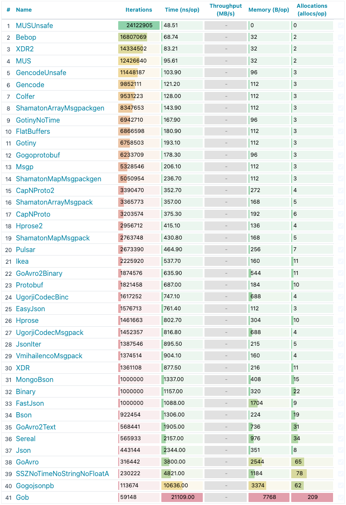

# Benchmarks of Go serialization methods

[](https://gitter.im/alecthomas/Lobby)

This is a test suite for benchmarking various Go serialization methods.

## Tested serialization methods

- [encoding/gob](http://golang.org/pkg/encoding/gob/)
- [encoding/json](http://golang.org/pkg/encoding/json/)
- [github.com/json-iterator/go](https://github.com/json-iterator/go)
- [github.com/alecthomas/binary](https://github.com/alecthomas/binary)
- [github.com/davecgh/go-xdr/xdr](https://github.com/davecgh/go-xdr)
- [github.com/Sereal/Sereal/Go/sereal](https://github.com/Sereal/Sereal)
- [github.com/ugorji/go/codec](https://github.com/ugorji/go/tree/master/codec)
- [github.com/vmihailenco/msgpack/v4](https://github.com/vmihailenco/msgpack)
- [labix.org/v2/mgo/bson](https://labix.org/v2/mgo/bson)
- [github.com/tinylib/msgp](https://github.com/tinylib/msgp) *(code generator for msgpack)*
- [google.golang.org/protobuf](https://google.golang.org/protobuf) (generated code)
- [github.com/gogo/protobuf](https://github.com/gogo/protobuf) (generated code, optimized version of `goprotobuf`)
- [go.dedis.ch/protobuf](https://go.dedis.ch/protobuf) (reflection based)
- [github.com/google/flatbuffers](https://github.com/google/flatbuffers)
- [github.com/hprose/hprose-go/io](https://github.com/hprose/hprose-go)
- [github.com/glycerine/go-capnproto](https://github.com/glycerine/go-capnproto)
- [zombiezen.com/go/capnproto2](https://godoc.org/zombiezen.com/go/capnproto2)
- [github.com/andyleap/gencode](https://github.com/andyleap/gencode)
- [github.com/pascaldekloe/colfer](https://github.com/pascaldekloe/colfer)
- [github.com/linkedin/goavro](https://github.com/linkedin/goavro)
- [github.com/ikkerens/ikeapack](https://github.com/ikkerens/ikeapack)
- [github.com/niubaoshu/gotiny](https://github.com/niubaoshu/gotiny)
- [github.com/prysmaticlabs/go-ssz](https://github.com/prysmaticlabs/go-ssz)
- [github.com/200sc/bebop](https://github.com/200sc/bebop) (generated code)
- [github.com/shamaton/msgpackgen](https://github.com/shamaton/msgpackgen) (generated code)
- [github.com/mus-format/mus-go](https://github.com/mus-format/mus-go)

## Running the benchmarks

```bash
go get -u -t
go test -bench='.*' ./
```

## Recommendation

If performance, correctness and interoperability are the most
important factors, [gogoprotobuf](https://gogo.github.io/) is
currently the best choice. It does require a pre-processing step (eg.
via Go 1.4's "go generate" command).

But as always, make your own choice based on your requirements.

## Data

The data being serialized is the following structure with randomly generated values:

```go
type A struct {
    Name     string
    BirthDay time.Time
    Phone    string
    Siblings int
    Spouse   bool
    Money    float64
}
```

## Results

2023-05-03 Results with Go 1.20.3 darwin/amd64 on an `Intel(R) Core(TM) i7-9750H CPU @ 2.60GHz` processor.

> To see interactive results using [go-bench-viewer](https://github.com/nidorx/go-bench-viewer), go
> to <https://nidorx.github.io/go-bench-viewer>, paste the raw result below and
> use the following regex to group the data: `Benchmark_(?<NAME>[^_/]+)_(?<GROUP>.*)$`


### Marshal


### Unmarshal


### RAW

```shell
goos: darwin
goarch: amd64
pkg: github.com/alecthomas/go_serialization_benchmarks
cpu: Intel(R) Core(TM) i7-9750H CPU @ 2.60GHz
Benchmark_Gotiny_Marshal-12                         	 3564903	       328.6 ns/op	        47.99 B/serial	     168 B/op	       5 allocs/op
Benchmark_Gotiny_Unmarshal-12                       	 6758503	       193.1 ns/op	        48.00 B/serial	     112 B/op	       3 allocs/op
Benchmark_GotinyNoTime_Marshal-12                   	 3923052	       301.6 ns/op	        48.00 B/serial	     168 B/op	       5 allocs/op
Benchmark_GotinyNoTime_Unmarshal-12                 	 6942710	       167.9 ns/op	        47.99 B/serial	      96 B/op	       3 allocs/op
Benchmark_Msgp_Marshal-12                           	10408419	       121.6 ns/op	        97.00 B/serial	     128 B/op	       1 allocs/op
Benchmark_Msgp_Unmarshal-12                         	 5328546	       206.1 ns/op	        97.00 B/serial	     112 B/op	       3 allocs/op
Benchmark_VmihailencoMsgpack_Marshal-12             	 1842178	       634.8 ns/op	        92.00 B/serial	     264 B/op	       4 allocs/op
Benchmark_VmihailencoMsgpack_Unmarshal-12           	 1374514	       904.1 ns/op	        92.00 B/serial	     160 B/op	       4 allocs/op
Benchmark_Json_Marshal-12                           	 1215380	       989.9 ns/op	       148.7 B/serial	     208 B/op	       2 allocs/op
Benchmark_Json_Unmarshal-12                         	  443144	      2344 ns/op	       148.6 B/serial	     351 B/op	       8 allocs/op
Benchmark_JsonIter_Marshal-12                       	 1731501	       703.0 ns/op	       138.3 B/serial	     200 B/op	       3 allocs/op
Benchmark_JsonIter_Unmarshal-12                     	 1387546	       895.5 ns/op	       138.3 B/serial	     215 B/op	       5 allocs/op
Benchmark_EasyJson_Marshal-12                       	 1477989	       811.0 ns/op	       148.7 B/serial	     896 B/op	       6 allocs/op
Benchmark_EasyJson_Unmarshal-12                     	 1576713	       761.4 ns/op	       148.7 B/serial	     112 B/op	       3 allocs/op
Benchmark_Bson_Marshal-12                           	 1499434	       812.0 ns/op	       110.0 B/serial	     376 B/op	      10 allocs/op
Benchmark_Bson_Unmarshal-12                         	  922454	      1306 ns/op	       110.0 B/serial	     224 B/op	      19 allocs/op
Benchmark_MongoBson_Marshal-12                      	 1000000	      1236 ns/op	       110.0 B/serial	     240 B/op	       9 allocs/op
Benchmark_MongoBson_Unmarshal-12                    	 1000000	      1337 ns/op	       110.0 B/serial	     408 B/op	      15 allocs/op
Benchmark_Gob_Marshal-12                            	  270751	      3825 ns/op	       163.6 B/serial	    1616 B/op	      35 allocs/op
Benchmark_Gob_Unmarshal-12                          	   59148	     21109 ns/op	       163.6 B/serial	    7768 B/op	     209 allocs/op
Benchmark_XDR_Marshal-12                            	 1128219	      1070 ns/op	        88.00 B/serial	     376 B/op	      19 allocs/op
Benchmark_XDR_Unmarshal-12                          	 1361108	       877.5 ns/op	        88.00 B/serial	     216 B/op	      11 allocs/op
Benchmark_UgorjiCodecMsgpack_Marshal-12             	 1700720	       710.8 ns/op	        91.00 B/serial	    1240 B/op	       3 allocs/op
Benchmark_UgorjiCodecMsgpack_Unmarshal-12           	 1452357	       816.8 ns/op	        91.00 B/serial	     688 B/op	       4 allocs/op
Benchmark_UgorjiCodecBinc_Marshal-12                	 1584528	       761.7 ns/op	        95.00 B/serial	    1256 B/op	       4 allocs/op
Benchmark_UgorjiCodecBinc_Unmarshal-12              	 1617252	       747.1 ns/op	        95.00 B/serial	     688 B/op	       4 allocs/op
Benchmark_Sereal_Marshal-12                         	  653470	      1832 ns/op	       132.0 B/serial	     832 B/op	      20 allocs/op
Benchmark_Sereal_Unmarshal-12                       	  565933	      2157 ns/op	       132.0 B/serial	     976 B/op	      34 allocs/op
Benchmark_Binary_Marshal-12                         	  991881	      1316 ns/op	        61.00 B/serial	     360 B/op	      27 allocs/op
Benchmark_Binary_Unmarshal-12                       	 1000000	      1157 ns/op	        61.00 B/serial	     320 B/op	      22 allocs/op
Benchmark_FlatBuffers_Marshal-12                    	 1938604	       589.3 ns/op	        95.19 B/serial	     376 B/op	      10 allocs/op
Benchmark_FlatBuffers_Unmarshal-12                  	 6866598	       180.9 ns/op	        95.14 B/serial	     112 B/op	       3 allocs/op
Benchmark_CapNProto_Marshal-12                      	  880801	      1430 ns/op	        96.00 B/serial	    4392 B/op	       6 allocs/op
Benchmark_CapNProto_Unmarshal-12                    	 3203574	       375.3 ns/op	        96.00 B/serial	     192 B/op	       6 allocs/op
Benchmark_CapNProto2_Marshal-12                     	 1341883	       874.7 ns/op	        96.00 B/serial	    1452 B/op	       7 allocs/op
Benchmark_CapNProto2_Unmarshal-12                   	 3390470	       352.7 ns/op	        96.00 B/serial	     272 B/op	       4 allocs/op
Benchmark_Hprose_Marshal-12                         	 1917482	       734.3 ns/op	        82.27 B/serial	     415 B/op	       8 allocs/op
Benchmark_Hprose_Unmarshal-12                       	 1461663	       802.7 ns/op	        82.25 B/serial	     304 B/op	      10 allocs/op
Benchmark_Hprose2_Marshal-12                        	 3486853	       343.4 ns/op	        82.27 B/serial	       0 B/op	       0 allocs/op
Benchmark_Hprose2_Unmarshal-12                      	 2956712	       415.1 ns/op	        82.28 B/serial	     136 B/op	       4 allocs/op
Benchmark_Protobuf_Marshal-12                       	 2407221	       529.7 ns/op	        52.00 B/serial	     144 B/op	       7 allocs/op
Benchmark_Protobuf_Unmarshal-12                     	 1821458	       687.0 ns/op	        52.00 B/serial	     184 B/op	      10 allocs/op
Benchmark_Pulsar_Marshal-12                         	 2684406	       447.0 ns/op	        51.68 B/serial	     304 B/op	       7 allocs/op
Benchmark_Pulsar_Unmarshal-12                       	 2673390	       464.9 ns/op	        51.62 B/serial	     256 B/op	       7 allocs/op
Benchmark_Gogoprotobuf_Marshal-12                   	10708094	       104.1 ns/op	        53.00 B/serial	      64 B/op	       1 allocs/op
Benchmark_Gogoprotobuf_Unmarshal-12                 	 6233709	       178.3 ns/op	        53.00 B/serial	      96 B/op	       3 allocs/op
Benchmark_Gogojsonpb_Marshal-12                     	  125532	      8203 ns/op	       125.6 B/serial	    3094 B/op	      83 allocs/op
Benchmark_Gogojsonpb_Unmarshal-12                   	  113674	     10636 ns/op	       125.5 B/serial	    3374 B/op	      62 allocs/op
Benchmark_Colfer_Marshal-12                         	14116735	        82.15 ns/op	        51.10 B/serial	      64 B/op	       1 allocs/op
Benchmark_Colfer_Unmarshal-12                       	 9531223	       128.0 ns/op	        52.00 B/serial	     112 B/op	       3 allocs/op
Benchmark_Gencode_Marshal-12                        	11219223	       102.5 ns/op	        53.00 B/serial	      80 B/op	       2 allocs/op
Benchmark_Gencode_Unmarshal-12                      	 9852111	       121.2 ns/op	        53.00 B/serial	     112 B/op	       3 allocs/op
Benchmark_GencodeUnsafe_Marshal-12                  	18370482	        64.71 ns/op	        46.00 B/serial	      48 B/op	       1 allocs/op
Benchmark_GencodeUnsafe_Unmarshal-12                	11448187	       103.9 ns/op	        46.00 B/serial	      96 B/op	       3 allocs/op
Benchmark_XDR2_Marshal-12                           	11248621	       107.7 ns/op	        60.00 B/serial	      64 B/op	       1 allocs/op
Benchmark_XDR2_Unmarshal-12                         	14334502	        83.21 ns/op	        60.00 B/serial	      32 B/op	       2 allocs/op
Benchmark_GoAvro_Marshal-12                         	  627751	      1683 ns/op	        47.00 B/serial	     728 B/op	      24 allocs/op
Benchmark_GoAvro_Unmarshal-12                       	  316442	      3800 ns/op	        47.00 B/serial	    2544 B/op	      65 allocs/op
Benchmark_GoAvro2Text_Marshal-12                    	  575835	      2048 ns/op	       133.7 B/serial	    1320 B/op	      20 allocs/op
Benchmark_GoAvro2Text_Unmarshal-12                  	  568441	      1905 ns/op	       133.7 B/serial	     736 B/op	      31 allocs/op
Benchmark_GoAvro2Binary_Marshal-12                  	 2078848	       576.3 ns/op	        47.00 B/serial	     464 B/op	       9 allocs/op
Benchmark_GoAvro2Binary_Unmarshal-12                	 1874576	       635.9 ns/op	        47.00 B/serial	     544 B/op	      11 allocs/op
Benchmark_Ikea_Marshal-12                           	 1764505	       678.7 ns/op	        55.00 B/serial	     184 B/op	      10 allocs/op
Benchmark_Ikea_Unmarshal-12                         	 2225920	       537.7 ns/op	        55.00 B/serial	     160 B/op	      11 allocs/op
Benchmark_ShamatonMapMsgpack_Marshal-12             	 2677450	       445.5 ns/op	        92.00 B/serial	     192 B/op	       4 allocs/op
Benchmark_ShamatonMapMsgpack_Unmarshal-12           	 2763748	       430.8 ns/op	        92.00 B/serial	     168 B/op	       5 allocs/op
Benchmark_ShamatonArrayMsgpack_Marshal-12           	 3027620	       396.9 ns/op	        50.00 B/serial	     160 B/op	       4 allocs/op
Benchmark_ShamatonArrayMsgpack_Unmarshal-12         	 3365773	       357.0 ns/op	        50.00 B/serial	     168 B/op	       5 allocs/op
Benchmark_ShamatonMapMsgpackgen_Marshal-12          	 8943220	       131.6 ns/op	        92.00 B/serial	      96 B/op	       1 allocs/op
Benchmark_ShamatonMapMsgpackgen_Unmarshal-12        	 5050954	       236.7 ns/op	        92.00 B/serial	     112 B/op	       3 allocs/op
Benchmark_ShamatonArrayMsgpackgen_Marshal-12        	11539459	       101.5 ns/op	        50.00 B/serial	      64 B/op	       1 allocs/op
Benchmark_ShamatonArrayMsgpackgen_Unmarshal-12      	 8347653	       143.9 ns/op	        50.00 B/serial	     112 B/op	       3 allocs/op
Benchmark_SSZNoTimeNoStringNoFloatA_Marshal-12      	  361600	      3269 ns/op	        55.00 B/serial	     440 B/op	      71 allocs/op
Benchmark_SSZNoTimeNoStringNoFloatA_Unmarshal-12    	  230222	      4821 ns/op	        55.00 B/serial	    1184 B/op	      78 allocs/op
Benchmark_Bebop_Marshal-12                          	13395981	        84.85 ns/op	        55.00 B/serial	      64 B/op	       1 allocs/op
Benchmark_Bebop_Unmarshal-12                        	16807069	        68.74 ns/op	        55.00 B/serial	      32 B/op	       2 allocs/op
Benchmark_FastJson_Marshal-12                       	 2975484	       403.2 ns/op	       133.8 B/serial	     504 B/op	       6 allocs/op
Benchmark_FastJson_Unmarshal-12                     	 1000000	      1088 ns/op	       133.8 B/serial	    1704 B/op	       9 allocs/op
Benchmark_MUS_Marshal-12                            	16945045	        68.81 ns/op	        46.00 B/serial	      48 B/op	       1 allocs/op
Benchmark_MUS_Unmarshal-12                          	12426640	        95.61 ns/op	        46.00 B/serial	      32 B/op	       2 allocs/op
Benchmark_MUSUnsafe_Marshal-12                      	17657185	        65.46 ns/op	        49.00 B/serial	      64 B/op	       1 allocs/op
Benchmark_MUSUnsafe_Unmarshal-12                    	24122905	        48.51 ns/op	        49.00 B/serial	       0 B/op	       0 allocs/op
PASS
ok  	github.com/alecthomas/go_serialization_benchmarks	132.177s
```

## Issues

The benchmarks can also be run with validation enabled.

```bash
VALIDATE=1 go test -bench='.*' ./
```

Unfortunately, several of the serializers exhibit issues:

1. **(minor)** BSON drops sub-microsecond precision from `time.Time`.
2. **(minor)** Ugorji Binc Codec drops the timezone name (eg. "EST" -> "-0500") from `time.Time`.

```
--- FAIL: BenchmarkBsonUnmarshal-8
    serialization_benchmarks_test.go:115: unmarshaled object differed:
        &{20b999e3621bd773 2016-01-19 14:05:02.469416459 -0800 PST f017c8e9de 4 true 0.20887343719329818}
        &{20b999e3621bd773 2016-01-19 14:05:02.469 -0800 PST f017c8e9de 4 true 0.20887343719329818}
--- FAIL: BenchmarkUgorjiCodecBincUnmarshal-8
    serialization_benchmarks_test.go:115: unmarshaled object differed:
        &{20a1757ced6b488e 2016-01-19 14:05:15.69474534 -0800 PST 71f3bf4233 0 false 0.8712180830484527}
        &{20a1757ced6b488e 2016-01-19 14:05:15.69474534 -0800 -0800 71f3bf4233 0 false 0.8712180830484527}
```

All other fields are correct however.

Additionally, while not a correctness issue, FlatBuffers, ProtoBuffers, Cap'N'Proto and ikeapack do not
support time types directly. In the benchmarks an int64 value is used to hold a UnixNano timestamp.

3. **(major)** Goprotobuf has been disabled in the above, as it is no longer maintained and is incompatible with the latest changes to Google's Protobuf package. See discussions: [1](https://github.com/containerd/ttrpc/issues/62), [2](https://github.com/containerd/ttrpc/pull/99).

```
panic: protobuf tag not enough fields in ProtoBufA.state:

goroutine 148 [running]:
github.com/gogo/protobuf/proto.(*unmarshalInfo).computeUnmarshalInfo(0xc0000d9c20)
	/home/ken/src/go/pkg/mod/github.com/gogo/protobuf@v1.3.2/proto/table_unmarshal.go:341 +0x135f
github.com/gogo/protobuf/proto.(*unmarshalInfo).unmarshal(0xc0000d9c20, {0xcff820?}, {0xc000122fc0, 0x35, 0x35})
	/home/ken/src/go/pkg/mod/github.com/gogo/protobuf@v1.3.2/proto/table_unmarshal.go:138 +0x67
github.com/gogo/protobuf/proto.(*InternalMessageInfo).Unmarshal(0xc00013a8c0?, {0xe6d5f0, 0xc000114060}, {0xc000122fc0?, 0x35?, 0x35?})
	/home/ken/src/go/pkg/mod/github.com/gogo/protobuf@v1.3.2/proto/table_unmarshal.go:63 +0xd0
github.com/gogo/protobuf/proto.(*Buffer).Unmarshal(0xc00009fe28, {0xe6d5f0, 0xc000114060})
	/home/ken/src/go/pkg/mod/github.com/gogo/protobuf@v1.3.2/proto/decode.go:424 +0x153
github.com/gogo/protobuf/proto.Unmarshal({0xc000122fc0, 0x35, 0x35}, {0xe6d5f0, 0xc000114060})
	/home/ken/src/go/pkg/mod/github.com/gogo/protobuf@v1.3.2/proto/decode.go:342 +0xe6
github.com/alecthomas/go_serialization_benchmarks.Benchmark_Goprotobuf_Unmarshal(0xc0000d5680)
	/home/ken/src/go/src/github.com/alecthomas/go_serialization_benchmarks/serialization_benchmarks_test.go:853 +0x26a
testing.(*B).runN(0xc0000d5680, 0x1)
	/usr/local/go/src/testing/benchmark.go:193 +0x102
testing.(*B).run1.func1()
	/usr/local/go/src/testing/benchmark.go:233 +0x59
created by testing.(*B).run1
	/usr/local/go/src/testing/benchmark.go:226 +0x9c
exit status 2
FAIL	github.com/alecthomas/go_serialization_benchmarks	61.159s
```
